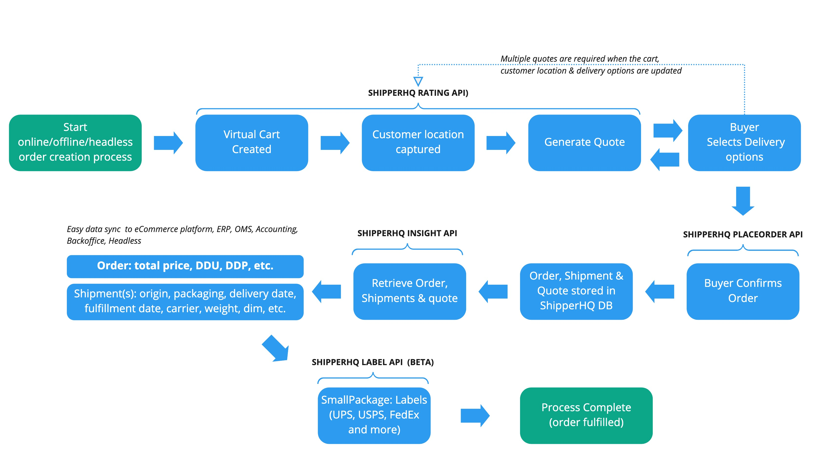

The Labels API enables you to produce shipping labels for shipments directly within your application.

## High level overview

## Early Access Program

The ShipperHQ Labels API is currently in closed Beta. Therefore, ShipperHQ is looking for early access partners interested in participating in this program.
Please [contact us](/contact) if interested.

:::note

Usage of the Labels API will not be free and its use is not covered by a base ShipperHQ subscription. A cost per label will be incurred when creating labels via this API. Exact pricing will be announced in future.

:::
