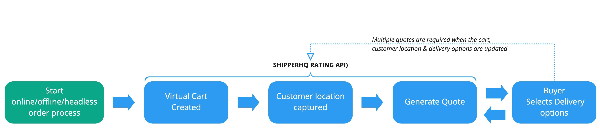

# How Rates Work

## High level description

## Typical workflow

In order to generate a shipping quote that contains, usually, multiple rates here is a typical workflow:

1. Submit a request that includes the contents of the cart, like item’s weight, value and quantity and include destination address information 
1. The request can include any other shipping options required like liftgate,  residential address or specific delivery dates for this order
1. Our API will return shipping rates for the cart using your ShipperHQ configured rules and carriers

Depending on whether you choose to request simple rates or full shipping rates, we can return basic rate information or full details of carriers, shipments, dates and shipping options available.

## What is best: a single rate request or multiple rate requests?

There are no right or wrong answer to this question: your application is responsible for sending to ShipperHQ accurate information. Some applications generate lots of rates requests while others require a single rate request for each order. 

Here a some pointers that could help you better understand your needs:
* Applications with a simple workflow and little ability to customize an order tend to generate less rate requests
* Applications with lots of options and lots of ability to customize an order (split shipment, delivery date options, ability select a delivery date & time, etc.) tend to generate multiple rate request for each cart.
* Applications that display rates during the process (ex: on the product page, in the cart, at checkout) tend to generate multiple rate requests for each cart as well.

## Key queries used for rate requests

The rating API is a read-only API. It consists of three queries:

| Query                      | Description         |
| ---------------------------|---------------------|
|`retrieveShippingQuote`     |	Retrieve basic shipping rates including carrier and method titles and total shipping charges. |
|`retrieveFullShippingQuote`	| Retrieve detailed shipping rate information for each shipment, including origin or warehouse information, carrier and method information, freight options available, available dates, in-store pickup information, and more.|
|`retrieveUserSettings`|	Retrieve merchant’s settings like locale and currency.|
