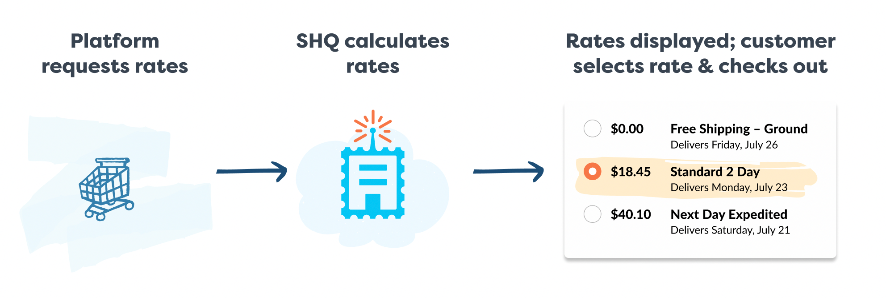

# Rate API Overview

## What are rates?

Shipping rates are an essential part of commerce. They includes various delivery methods like small parcels, freight (LTL/FTL), in-store pickup, curb-site pickup and local delivery. All of these are Shipping Rate which we will call “rates” in the context of this documentation. In general a "rate" is a set of properties that describe options to get good delivered to a buyer. The minimal information it contains is usually a name, description and a price (in a currency).

## How does a typical platform interact with rates?

1. An application request rates via this API
2. ShipperHQ calculate rates based on the cart content and buyer destination
3. The buyer select the delivery options of his choice
4. The platform flow continue (not represented here) and the order is processed

## How does ShipperHQ produce rates?

ShipperHQ is a rule-based platform that generate shipping rates following key characteristics of the purchase (items in the cart, weight, dimensions, buyer category, cart value, etc). ShipperHQ most used functionalities are dimensional shipping (being able to compute box size based on product dimensions), live rates (being able to query one or multiple carriers like UPS, USPS, FedEX to get real-time pricing) and Delivery Dates (being able to predict when a package will be delivered). We also support freight (LTL, FTL), local-pickup, local-delivery and multi-location (for more information about ShipperHQ capabilities, please visite our [website](https://www.shipperhq.com/))

Thanks to the rating API, you don’t have to implement all this logic in your application: via our simple to use rating API, you can integrate with ShipperHQ to easily get rates. With a few lines of code, you will be able to support the most complex shipping and delivery use case with split-shipments, multiple origins, different delivery methods (per shipment) as well as provide delivery dates at checkout time for each shipment.

## Typical Usage for the Rating API

Here are some typical examples of integrations relying on the rating API:
* CRM integration: It provides sales team with the ability to display live rates while respecting a complex business logic (configured in ShipperHQ). Quotes can be live and accurate instead of estimated (both the price and delivery date can be retrieved). The shipping rates returned by ShipperHQ can be overriden in your ERP following your own business rules and authorization system.
* ERP integration: When creating draft-orders or manual orders, rates can be retrieved from ShipperHQ so that the order shipping costs can be accurately retrieved. It enable multi-channel orders (online, offline, direct sale, etc.) to use the exact same logic for shipping & delivery rates. The shipping rates returned by ShipperHQ can be overriden in your ERP following your own business rules and authorization system.
* Unsupported eCommerce platform integration: While ShipperHQ support the major eCommerce platforms, with the rating API, developers can integrate ShipperHQ to provide rates at checkout leveraging the rich functionality of ShipperHQ rules engine and advanced functions. For this use case, the rating API is called either in the cart or when the user enter her/his address. Each time the cart changes, a new query has to be triggered in order to get a new quote. Then the buyer select one option and complete the checkout.
* Headless commerce: No need for an ecommerfce platform. With ShipperHQ SDK you can build your own experience using tools and technologies that you selected. The rating API will enable you to focus on the user experience while all the business logic is configured in ShipperHQ. 